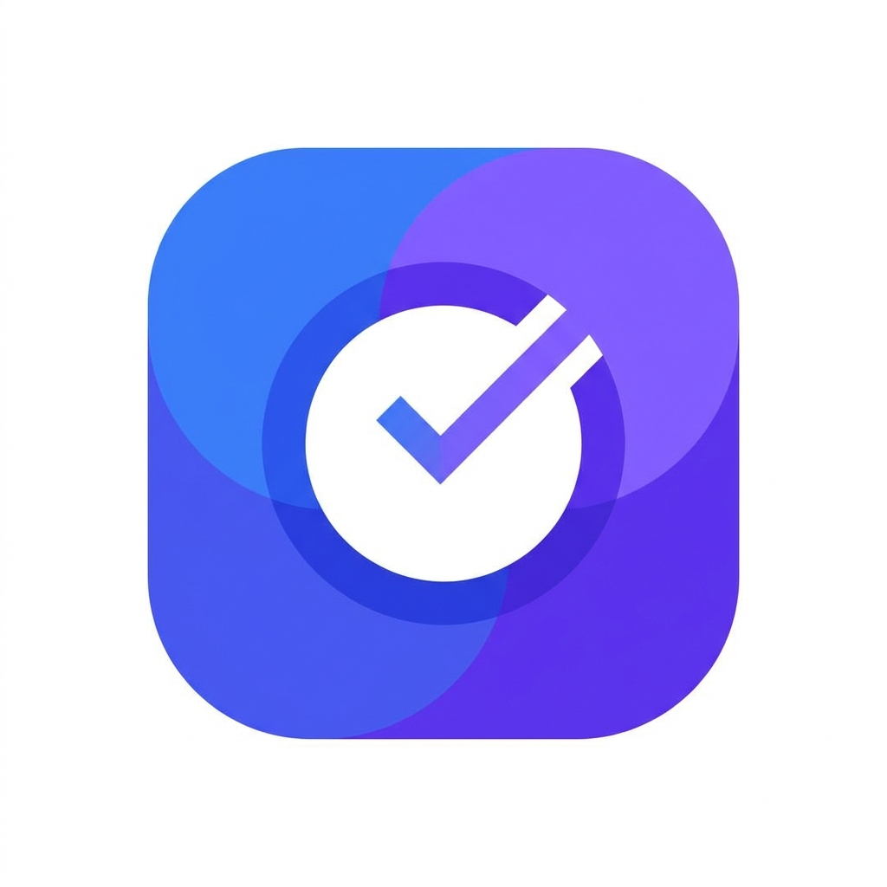

# Clockly 🕒

<p align="center">
  
  <br>
  <b>A Collaborative Task Management & Gamified Productivity Mobile Application</b>
  <br>
  <i>Empower your workflow, sync with your team, and track your productivity trend. Built with Flutter, GetX, and Supabase.</i>
</p>

---

## 🌟 Introduction

**Clockly** is an all-in-one productivity and task management application designed to elevate your time management, task scheduling, and team collaboration. More than just a simple to-do list, Clockly integrates gamified leaderboards, real-time messaging, deep analytics, and cross-platform native calendar synchronization. 

Whether you are working individually or coordinating with a team, Clockly keeps you organized, focused, and motivated with direct visual feedback on your productivity journey.

---

## 🚀 Core Features

- 🔐 **Secure Authentication**: Instant and secure registration, login, password recovery, and password resetting powered by **Supabase Auth**.
- 📋 **Robust Task Management**: 
  - Categorized tasks (Work, Personal, Study, etc.) with priority levels (Low, Medium, High).
  - Effortless workflows: search, filter, slide-to-delete (powered by `flutter_slidable`), and intuitive swipe actions.
  - Interactive bottom sheet dialogs to view, edit, or create tasks with ease.
- 🏆 **Gamified Leaderboard**:
  - Stay motivated! Earn productivity points by completing tasks on time.
  - Compete weekly or monthly with colleagues and friends.
  - Enjoy satisfying task-completion celebrations (powered by `confetti`).
- 📊 **Productivity Analytics & Trend Reports**:
  - Beautiful visual performance reports with category-wise breakdown charts and trend lines (built using `fl_chart`).
  - Keep track of task completion rates, weekly performance metrics, and productivity growth over time.
- 📅 **Smart Calendar Integration**:
  - Full-featured calendar dashboard (`table_calendar`) showing task deadlines and events day-by-day.
  - Synchronize in one tap: add your tasks directly to your smartphone's native operating system calendar (`add_2_calendar`).
- 💬 **Team Collaboration & Real-Time Chat**:
  - Seamlessly assign tasks to teammates and friends.
  - Built-in real-time team chat interface with styled message bubbles (`chat_bubbles`) to collaborate instantly on projects and tasks.
- 🎨 **Premium Modern UI/UX**:
  - Toggle between **Light Mode** and **Dark Mode** effortlessly.
  - Modern animations (using `flutter_spinkit` and custom transitions).
  - Rich typography from Google Fonts and a premium icon library using **Hugeicons**.
- 📴 **Offline-First Synchronization**:
  - Fully integrated local database (`sqflite`) that stores and caches tasks offline.
  - Uses `connectivity_plus` to monitor internet connection and sync local edits back to Supabase seamlessly once connection is restored.
  - Native push notification alerts (`flutter_local_notifications`) configured with custom timezone offsets.

---

## 🛠️ Tech Stack & Key Libraries

- **Framework**: [Flutter](https://flutter.dev/) (Dart)
- **State Management & Routing**: [GetX](https://pub.dev/packages/get) (Highly reactive binding/routing system)
- **Backend & Database**: [Supabase](https://supabase.com/) (Real-time updates, Postgres Database, Storage, and Auth)
- **Local Persistence**: [Sqflite](https://pub.dev/packages/sqflite) (SQLite for mobile caching) & SharedPreferences
- **Analytics Visualization**: [fl_chart](https://pub.dev/packages/fl_chart)
- **Interactive Calendar**: [table_calendar](https://pub.dev/packages/table_calendar) & [add_2_calendar](https://pub.dev/packages/add_2_calendar)
- **Environment Management**: [flutter_dotenv](https://pub.dev/packages/flutter_dotenv)

---

## 📂 Project Architecture

Clockly implements a modern **Feature-First / Layered Architecture** powered by **GetX** for optimal separation of concerns, scalability, and ease of maintainability.

```text
lib/
├── app.dart                  # App-wide root widget (GetMaterialApp config, Themes)
├── main.dart                 # App initialization (Supabase, Env variables, Timezones)
├── bidings/                  # Global app-wide dependency injection
├── routes/                   # Routing and navigation configuration (AppRoutes, AppPages)
├── core/                     # Common core utilities, shared themes, services, and models
│   ├── services/             # Core services (e.g., Supabase Auth service, background sync)
│   ├── theme/                # Global UI Themes (Light & Dark theme settings)
│   └── utils/                # Utility classes (Theme helpers, formatters)
└── features/                 # Modular, feature-first directories
    ├── auth/                 # Sign In, Sign Up, Password recovery & Splash components
    ├── task_home/            # Primary Task dashboard, bottom sheets, list items
    ├── calendar/             # Table Calendar UI and event listing
    ├── analys/               # Charts, trend metrics, and weekly statistics
    ├── leader_board/         # Points, rankings, and gamified statistics
    ├── page_chat/            # Group messaging, friends directory, and chat UI
    └── setting/              # Appearance toggles, profile editing, and app configurations
```

---

## ⚙️ Setup & Installation

Follow these steps to run the Clockly project locally on your machine.

### 1. Prerequisites
- **Flutter SDK**: Ensure you have Flutter installed (SDK Version `^3.11.4` or higher). Check your version using:
  ```bash
  flutter --version
  ```
- **Supabase Account**: You will need a Supabase project to provide the backend database and authentication.

### 2. Configure Environment Variables
Create a file named `.env` in the root directory of the project (at the same level as `pubspec.yaml`):

```env
URL_SUPABASE=https://your-project-id.supabase.co
ANON_KEY=eyJhbGciOiJIUzI1NiIsInR5cCI6IkpXVCJ9...your-supabase-anon-key...
```

*Note: The `.env` file is already listed in the assets section of `pubspec.yaml` so that it loads dynamically at launch.*

### 3. Native Platform Setup
- **Android Configuration**:
  Make sure your minimum Android SDK version is configured to `21` (required by Sqflite, Local Notifications, and Supabase integration) in `android/app/build.gradle`.
- **iOS Configuration**:
  Ensure you run `pod install` in the `ios` directory before building.

### 4. Build & Run
Get all dependencies and run the application on your emulator or connected device:

```bash
# Get all Dart dependencies
flutter pub get

# Run on a connected emulator/device
flutter run
```

---

## 🗄️ Database & Schema Design

Clockly operates on a unified model combining local SQLite tables with a matching Supabase PostgreSQL schema to guarantee real-time and offline synchronization. Here are the core conceptual tables:

1. **`users`**: Manages user profiles, custom avatars, setting preferences, and current leaderboard points.
2. **`tasks`**: Stores individual and team tasks containing title, details, category, priority, status (pending/completed), assigned friends, and scheduled deadline.
3. **`chats`**: Handles group/friend discussions, storing text payloads, sender details, and absolute timestamps.
4. **`leaderboard`**: Holds scores derived from task completion efficiency.

---

## 🤝 Contribution Guidelines

We welcome contributions to Clockly! If you'd like to improve the app:
1. **Fork** the repository.
2. Create a new feature branch (`git checkout -b feature/AmazingFeature`).
3. **Commit** your changes (`git commit -m 'Add some AmazingFeature'`).
4. **Push** to the branch (`git push origin feature/AmazingFeature`).
5. Open a **Pull Request**.

---

## 📄 License
This project is developed as a final university/coursework project. You may use, inspect, and modify the source code for learning or non-commercial purposes. 

---

<p align="center">
  Made with ❤️ for a better, more organized workspace.
</p>
