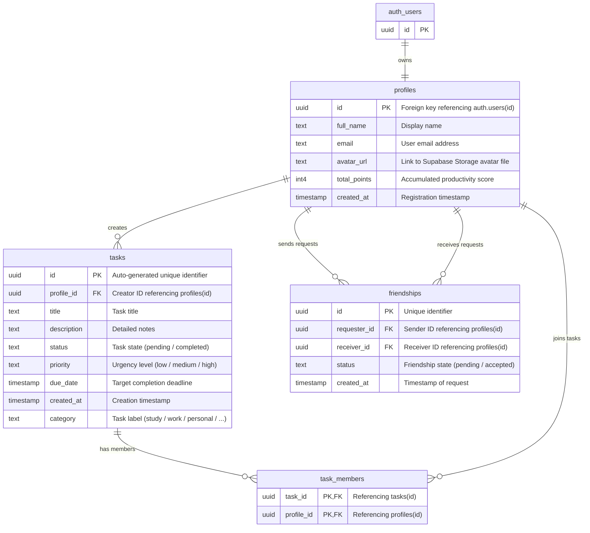

# Clockly

<p align="center">
  
  <br>
  <b>Collaborative Task Management and Gamified Productivity Mobile Application</b>
  <br>
  <i>Synchronize work, collaborate with teams, and monitor performance using Flutter, GetX, and Supabase.</i>
</p>

---

## 📝 Overview
We develop Clockly as a production-grade mobile application to optimize time management and collaborative workflows. The system combines gamified point accumulations, competitive leaderboards, a natural language AI chatbot, data analytics, and platform-native calendar synchronization.

---

## 🛠️ Technology Stack

### Client Side (Mobile Application)
* **Framework**: Flutter SDK (Dart) for high-performance cross-platform interfaces.
* **State Management & Routing**: GetX to separate business logic and automate dependency injections through GetX Bindings.
* **Configuration Management**: `flutter_dotenv` to secure API credentials and environment variables.

### Backend Side (BaaS & Database)
* **Database & Cloud Infrastructure**: Supabase Flutter SDK to connect the PostgreSQL database.
* **Real-time Synchronization**: Supabase Realtime channels to broadcast changes from the `tasks` and `profiles` tables.
* **Asset Storage**: Supabase Storage to host user avatars in the `images` bucket.
* **Authentication**: Supabase Auth to manage sign-ups, logins, and OTP email recoveries.

### Artificial Intelligence
* **Language Processing API**: Groq API using the `llama-3.3-70b-versatile` model.
* **Parsing Engine**: Converts conversational text inputs into structured JSON objects (specifying titles, descriptions, due dates, categories, and priority levels) and writes them to the database.

### Core Libraries & Utilities
* **Data Visualization**: `fl_chart` to render productivity progress and week trends.
* **Calendar Integration**: `table_calendar` for month and week dashboards, and `add_2_calendar` to sync events with Android and iOS system calendars.
* **Animations & Interactivity**: `flutter_slidable` for swipe-to-delete lists, `confetti` for goal celebration effects, and `flutter_spinkit` for loading states.
* **System Alerts**: `flutter_local_notifications` and `timezone` to schedule precise push notifications offline.
* **Deep Linking**: `app_links` to handle `clockly://addtask` URLs for fast task creation outside the application interface.

---

## 🗄️ Database Schema Design
Clockly relies on a relational PostgreSQL database hosted on Supabase. The system operates on four main tables to enforce data integrity:



### Table Definitions

#### `profiles` Table
Stores user profile information linked to the authentication system:
* `id` (`uuid`, Primary Key): References the Supabase `auth.users(id)` record.
* `full_name` (`text`): Display name.
* `email` (`text`): Registered email address.
* `avatar_url` (`text`): Supabase Storage hosts the public access URL for files.
* `total_points` (`int4`): Accumulated points to compute competitor rankings.
* `created_at` (`timestamp`): Registration timestamp.

#### `tasks` Table
Manages tasks created by individual users or team collaborators:
* `id` (`uuid`, Primary Key): Auto-generated unique identifier.
* `profile_id` (`uuid`, Foreign Key): Identifies the creator by referencing profiles(id).
* `title` (`text`): Short task name.
* `description` (`text`, Nullable): Detailed notes.
* `status` (`text`): State of the task, containing either `pending` or `completed`.
* `priority` (`text`): Priority level categorized as `low`, `medium`, or `high`.
* `due_date` (`timestamp`, Nullable): Completion deadline.
* `category` (`text`): Label specifying the class of task, such as `study`, `work`, `coding`, `teaching`, `health`, `personal`, or `general`.
* `created_at` (`timestamp`): System writes creation time to this column.

#### `task_members` Table
Resolves the many-to-many relationship between `tasks` and `profiles` to support group assignments:
* `task_id` (`uuid`, Primary Key, Foreign Key): References `tasks(id)`.
* `profile_id` (`uuid`, Primary Key, Foreign Key): References profiles(id) of the participant.

#### `friendships` Table
Tracks social connections and request states:
* `id` (`uuid`, Primary Key): Auto-generated unique identifier.
* `requester_id` (`uuid`, Foreign Key): References requester profiles(id).
* `receiver_id` (`uuid`, Foreign Key): References receiver profiles(id).
* `status` (`text`): State of the invitation, containing either `pending` or `accepted`.
* `created_at` (`timestamp`): Creation timestamp of the invitation request.

---

## 📂 Project Architecture
Clockly organizes codebase modules by feature layers to maximize component isolation and code reuse:

```text
lib/
├── app.dart                  # Root application configuration (GetMaterialApp, Light/Dark themes)
├── main.dart                 # Initialization entrypoint (env loading, timezone configuration)
├── bindings/                 # Dependency injection rules (Global GetX Bindings)
├── routes/                   # Routing declarations (AppRoutes, AppPages)
├── core/                     # Shared application assets and services
│   ├── components/           # Reusable widgets (custom alerts, snacks, loaders)
│   ├── constants/            # Global string assets and constant metrics
│   ├── services/             # Core integrations (Supabase Client, Groq AI, notifications)
│   ├── theme/                # Light and Dark visual design system tokens
│   └── utils/                # Date parsers, formatting helpers, and theme bindings
└── features/                 # Modular application features
    ├── auth/                 # Sign-up, login, password recovery, and OTP workflows
    ├── task_home/            # Main dashboard, bottom sheets, task list templates
    ├── calendar/             # Month and week dashboards with event listings
    ├── analys/               # Performance statistics and chart builders
    ├── leader_board/         # Friend directories, invitation systems, and ranking boards
    ├── page_chat/            # AI conversational interface for fast task creations
    └── setting/              # Profile edits, avatar managers, and configuration toggles
```

---

## 🚀 Core Features

### 🔐 Secure Authentication
Supabase Auth secures user accounts. The system issues email verification codes (OTP) to validate registrations and authorize password resets.

### 📋 Collaborative Task Management
Create personal goals or organize team projects. The application categorizes tasks, assigns priority scales, and supports interactive swipe gestures to edit or remove records.

### 🤖 AI Conversational Assistant
The chat workspace connects with the Groq Llama 3.3 engine to parse language prompts. Write inputs like: "Code flutter widgets tomorrow at 9 PM" and the AI will extract titles, deadlines, and priorities, creating a database entry without manual form inputs.

### 📊 Performance Analytics
The application computes performance ratios across completed, pending, and overdue tasks. Touch-interactive pie charts and week bar trends map out personal work habits.

### 📅 Smart Calendar Sync
Review deadlines in a month dashboard. A single button tap exports task details to the native iOS or Android system calendar application.

### 🏆 Gamified Rankings
Earn points for completing tasks before deadlines. Confetti animations mark goal completions, updating competitor leaderboard rankings among verified friends.

---

## ⚙️ Setup & Installation

### Step 1: System Requirements
* Install Flutter SDK version `3.11.4` or higher.
* Set up an emulator or connect a physical debugging device.

### Step 2: Fetch Dependencies
Navigate to the root directory and retrieve package dependencies:
```bash
flutter pub get
```

### Step 3: Configure Environment (.env)
Create a `.env` file in the root folder (same level as `pubspec.yaml`):
```env
URL_SUPABASE=https://your-project-id.supabase.co
ANON_KEY=eyJhbGciOiJIUzI1NiIsInR5cCI6IkpXVCJ9...your-supabase-anon-key...
GROQ_API_KEY=gsk_your_groq_api_key_here
```
*Note: Replace these values with your actual Supabase hosts and API keys.*

### Step 4: Platform-Specific Setup
* **Android**: Verify `minSdkVersion` is set to `21` or higher in `android/app/build.gradle` to support notification engines and persistence systems.
* **iOS**: Execute pod installations:
  ```bash
  cd ios
  pod install
  cd ..
  ```

### Step 5: Run Application
Deploy the build to your active device:
```bash
flutter run
```

---

## 🤝 Contributions & License
We release Clockly under the MIT License. Contributions to enhance features or resolve issues are welcome. Submit pull requests or log issues directly on the repository tracker.

---

## 👨‍💻 Development Team

* **Lead Engineer**: Nguyễn Ngọc Bình
* **Email**: binhnguyenngoc.it@gmail.com
* **GitHub**: [@ngocbinh15](https://github.com/ngocbinh15)

_We develop Clockly as an active project. Report issues or send recommendations to support our roadmap! 🚀_